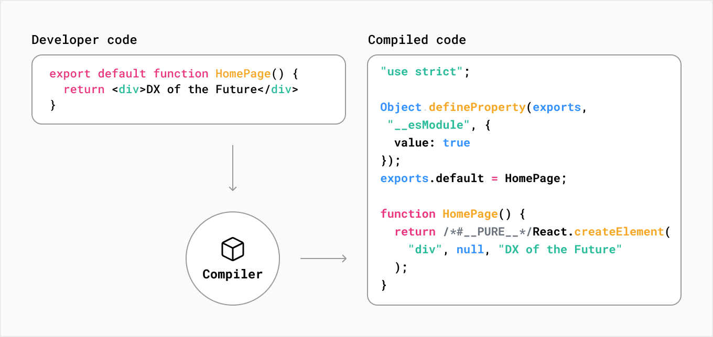

# Next

## Que es la compilación?

Compilación o tiempo de compilación, se refiere al proceso de tomar el código en un lenguaje y transformarlo en otro lenguaje o bien, en otra versión del mismo lenguaje

Un ejemplo puede ser cuando los desarrolladores usan TypeScript. A pesar de que es un lenguaje cómodo y seguro de utilizar, los navegadores no lo comprenden. 

Por esto mismo es que TypeScript se compila a una versión de JavaScript que sea soportada por la mayoría de los navegadores

Este proceso ocurre durante la fase de desarrollo mientras editamos nuestro código como "preparación" para la fase de producción 

## Que es la minificación?

Los desarrolladores escriben código que sea fácil de leer para los humanos. El código puede contener información extra que no es necesaria para que el código funcione, como comentarios, espacios, identaciones y múltiples líneas

El proceso de minificar un archivo es remover el código innecesario como el formateo y los comentarios sin cambiar la funcionalidad del código
