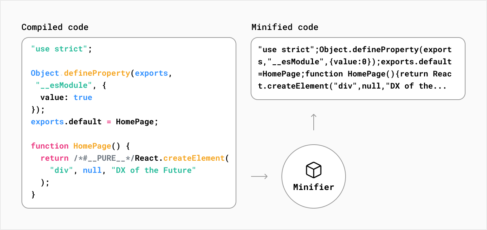

# Next

## Que es compiling?

Compiling o tiempo de compilación, se refiere al proceso de tomar el código en un lenguaje y transformarlo en otro lenguaje o bien, en otra versión del mismo lenguaje

Un ejemplo puede ser cuando los desarrolladores usan TypeScript. A pesar de que es un lenguaje cómodo y seguro de utilizar, los navegadores no lo comprenden. 

Por esto mismo es que TypeScript se compila a una versión de JavaScript que sea soportada por la mayoría de los navegadores

Este proceso ocurre durante la fase de desarrollo mientras editamos nuestro código como "preparación" para la fase de producción 

## Que es la minifying?

Los desarrolladores escriben código que sea fácil de leer para los humanos. El código puede contener información extra que no es necesaria para que el código funcione, como comentarios, espacios, identaciones y múltiples líneas

El proceso de minifying un archivo es remover el código innecesario como el formateo y los comentarios sin cambiar la funcionalidad del código

El objetivo de este proceso es disminuir el peso de los archivos para mejorar el rendimiento

En Next.js, los archivos JavaScript y CSS son automaticamente minificados cuando el projecto esta en fase de produccion.

## Que es bundling?

Habitualmente los desarrolladores "rompen" la aplicacion en modulos, componentes y funciones ya que, si no fuese asi, las aplicaciones serian monolitos llenos de informacion y seria ininteligible.

## Que es code splitting?

Normalmente los desarrolladores dividen la aplicacion en distintas paginas que pueden ser accedidas por distintas urls. Cada una de estas forma un unico entry point a la aplicacion.

Code splitting es el proceso de separar el bundle de la aplicacion en "chunks" mas pequeños

Next.js realiza esta tarea automaticamente con cada elemento que este dentro de `/pages` separando cada uno en distintos bundles.

El code splitting automatico tambien ocurre en los siguientes casos

- El codigo compartido entre distintas paginas es splitteado en otro bundle para no descargar el mismo codigo en otras navegaciones

- Despues de la carga inicial, Next.js puede comenzar a pre-cargar el codigo de otras paginas que el usuario posiblemente navegue

- [Dynamic Imports]([Advanced Features: Dynamic Import | Next.js](https://nextjs.org/docs/advanced-features/dynamic-import)) es otra forma de dividir manualmente el codigo que carga inicialmente

## Build time vs Production time

**Build time** es el nombre dado a una serie de pasos que prepara el codigo de tu aplicacion para produccion.

Cuando buildeas tu aplicacion, Next.js va a transformar tu codigo en archivos optimizados de produccion listos para ser deployados al servidor y ser consumido por los usuarios. Estos archivos que optimiza pueden ser:

- Archivos HTML para paginas staticamente generadas

- Codigo JavaScript para paginas con SSR

- Codigo JavaScript para hacer paginas interactivas

- Archivos CSS

**Runtime** es el periodo de tiempo cuando tu aplicacion corre en respuesta a una consulta del usuario, despues de que tu aplicacion fue buildeada y deployada

## Que es el rendering?

Hay una unidad inesquivable de trabajo para convertir el codigo que escribiste en React a una representacion HTML de tu interfaz. Este proceso se llama **rendering**.

El rendering puede tomar lugar en el servidor o en el cliente. Puede suceder en build time o en runtime con cada request.

Con Next.js, hay tres tipos de rendering disponibles. **Server-Side Rendering** (SSR), **Static Site Generation** (SSG) y **Client-Side Rendering** (CSR).

### Pre-Rendering

SSR y SSG son tambien referidos a pre-rendering porque la busqueda de informacion externa (nuestra aplicacion o partes de ella) y la transformacion de los componentes React a HTML (rendering) ocurre antes de que el resultado sea enviado al cliente. 

Es decir, siempre que el rendering ocurra antes de que el cliente reciba la respuesta, se considera pre-rendering. Entonces, SSR y SSG son formas de pre-rendering porque el rendering ocurre en el servidor, antes de que el cliente reciba la respuesta.

### Client-Side Rendering vs Pre-Rendering

En las aplicaciones que solamente utilizan React, el navegador recibe un HTML vacio desde el servidor junto con las instrucciones JavaScript para construir la UI. Esto es llamado **Client-Side Rendering** porque el rendering inicial ocurre en el dispositivo del usuario.

> *Nota: Podes optar por usar CSR para componentes especificos en tu aplicacion Next.js haciendo fetching de la data con useEffect  o un hook de data fetching como useSWR*

En contraste, Next.js pre-renderiza cada pagina por defecto. Pre-rendering significa que el HTML es generado por adelantado en el servidor en lugar de tenerlo todo hecho por JavaScript en el dispositivo del usuario.

En la practica, esto significa que en una aplicacion completamente renderizada con CSR, el usuario va a a ver una pagina en blanco mientras el rendering esta realizandose. Comparado al pre-rendering, donde el usuario ve un HTML estructurado.

Vamos a charlar un poco sobre los dos tipos de rendering.

### Server-side rendering

Con SSR, el HTML de la pagina es generado en el servidor por **cada** request. El HTML generado, informacion en JSON, y las instrucciones JavaScript para hacer la pagina interactiva son enviados al cliente.

En el cliente, el HTML es usado para mostrar una rapida pagina no interactiva, mientras React usa la informacion en JSON y las instrucciones JavaScript para hacer los componentes interactivos. Este ultimo proceso se llama **hidratacion**

Es importante notar que el SSG ocurre en runtime. Es decir, tenemos el servidor disponible para hacer request y recibir responses.

> *Nota para el futuro: Existen los [React Server Components](https://reactjs.org/blog/2020/12/21/data-fetching-with-react-server-components.html) en fase alpha. Basicamente son componentes React que se generan en el servidor y no es necesario enviar nada de JavaScript al servidor ya que la logica se corre en el servidor y este solo envia la data resultante de la logica ejecutada*

### Static Site Generation

Con SSG, el HTML es generado en el servidor, pero a diferencia del SSR, no hay un servidor en runtime, por lo tanto, no podemos hacer consultas al servidor ni recibir informacion de este. En lugar de ocurrir en runtime, el contenido se genera una sola vez en build time, cuando la aplicacion es deployada y el HTML es guardado en un CDN y re usado por cada consulta. 

> *Nota: Es importante conocer que es un CDN. Podes indagar un poco mas en [What is a network?]([What is the Network? - How Next.js Works | Learn Next.js](https://nextjs.org/learn/foundations/how-nextjs-works/cdns-and-edge))*

> *Nota: Podes usar Incremental Static Regeneration para crear o actualizar paginas estaticas despues de que hayas buildeado tu sitio. Esto significa que no tenes que re buildear tu sitio entero si tu informacion cambia*

La belleza de Next.js es que podes elegir el metodo de rendering mas apropiado para tu caso de uso pagina a pagina. 
